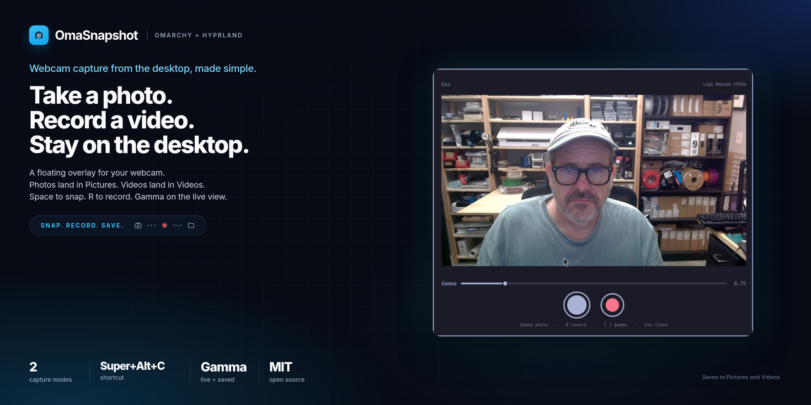

# OmaSnapshot

Take a photo or record a video with your webcam from a floating Omarchy overlay.

## Install

From this folder while developing:

```sh
./install.sh
```

That copies the plugin into `~/.config/omarchy/plugins/`, enables it, adds
**Trigger → Capture → Camera** to the Omarchy menu (when a webcam is present),
and binds **Super+Alt+C**. Super+Shift+C is already Calendar.

From a public repository:

```sh
omarchy plugin add https://github.com/cfaulkingham/omasnapshot.git --enable
./install.sh --desktop-only
```

`omarchy plugin add` does not run `install.sh`. Use `--desktop-only` for the
menu row and keybind after a git install, or add them by hand from the snippets
below.

## Usage

- Open with Super+Alt+C, the Capture menu, or:

```sh
omarchy-shell shell toggle io.github.cfaulkingham.omasnapshot '{}'
```

- **Space** or the shutter takes a photo
- **R** or the red button starts and stops a video (microphone is always on)
- **[** / **]** or the Gamma slider darken or lighten midtones. Right-click the slider (or double-click the label) to reset to 1.00. The same look is applied to saved photos and videos
- **Esc** or a click outside the card stops a recording if one is running, otherwise closes the overlay
- Live preview is mirrored; saved files are not
- Photos go to `$XDG_PICTURES_DIR` (usually `~/Pictures`)
- Videos go to `$XDG_VIDEOS_DIR` (usually `~/Videos`)

Override those folders with `OMARCHY_SCREENSHOT_DIR` and
`OMARCHY_SCREENRECORD_DIR`, the same variables Omarchy screenshots and
screen recordings use.

## Manual desktop integration

Menu (`~/.config/omarchy/extensions/omarchy-menu.jsonc`):

```jsonc
"trigger.capture.camera": {
  "icon": "󰄀",
  "label": "Camera",
  "description": "Take a photo or record a video with the webcam",
  "when": "omarchy-hw-webcam",
  "action": "omarchy-shell shell toggle io.github.cfaulkingham.omasnapshot '{}'"
}
```

Keybind (`~/.config/hypr/bindings.lua`):

```lua
o.bind("SUPER + ALT + C", "OmaSnapshot", "omarchy-shell shell toggle io.github.cfaulkingham.omasnapshot '{}'")
```

## Remove

```sh
./install.sh --remove-desktop
omarchy plugin remove io.github.cfaulkingham.omasnapshot
```

## Test

```sh
node test/paths-test.js
omarchy plugin validate "$PWD"
qmllint -I "$OMARCHY_PATH/shell" Overlay.qml CameraSession.qml
```
