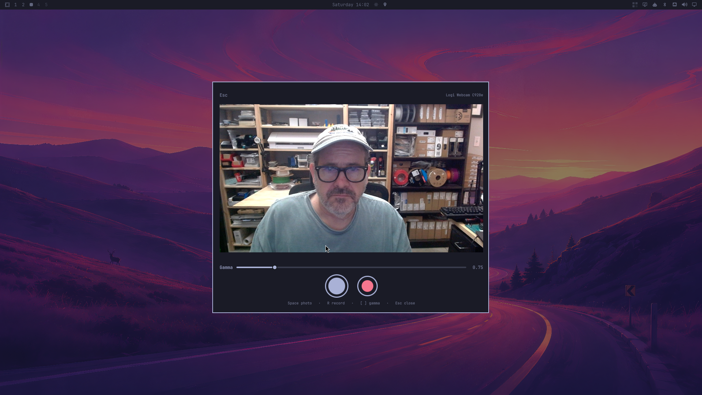

# OmaSnapshot

Take a photo or record a video with your webcam from a floating Omarchy overlay.

Opening the overlay starts the camera immediately. Click **Camera** on the
bar, or use the keybind, the Capture menu, or `omarchy-shell shell toggle`
after the optional desktop integration below. The microphone is used only
while a video is recording.

Gamma other than 1.00 is written into saved files with `/usr/bin/ffmpeg`.
Without ffmpeg, captures still save and the overlay shows "Could not apply
gamma".

## Install

`omarchy plugin add --enable` clones the plugin and places a **Camera**
button on the bar. Click that button to open the overlay. The default
section is the right side. An interactive add asks which section to use.

From GitHub:

```sh
omarchy plugin add https://github.com/cfaulkingham/omasnapshot.git --enable
```

A keybind and a Capture menu row live in Hyprland and the Omarchy menu, so
they are a second step:

```sh
~/.config/omarchy/plugins/io.github.cfaulkingham.omasnapshot/install.sh --desktop-only
```

`--desktop-only` adds **Trigger → Capture → Camera** (shown when a webcam
is present) and **Super+Alt+C**. Super+Shift+C is already Calendar.

From this folder while developing:

```sh
./install.sh
```

That copies the plugin into `~/.config/omarchy/plugins/`, enables it, places
**Camera** on the bar, and does the same desktop integration.

`./install.sh --plugin-only` copies the plugin, enables it, and places the
**Camera** button. It leaves the menu row and keybind unchanged.

If an older install enabled the overlay and the Camera button is missing,
place it with:

```sh
omarchy plugin disable io.github.cfaulkingham.omasnapshot
omarchy plugin enable io.github.cfaulkingham.omasnapshot --section right
```

`install.sh` edits `~/.config/hypr/bindings.lua` and
`~/.config/omarchy/extensions/omarchy-menu.jsonc` inside uniquely marked
blocks. It reloads Hyprland and rolls those files back if `hyprctl configerrors`
reports a problem. It refuses symlinks at those paths.

Or add the menu row and keybind by hand from the snippets below.

### Optional dependency: ffmpeg

Gamma post-processing needs the `ffmpeg` package, which provides
`/usr/bin/ffmpeg`. Install it separately using your system's package manager
if you want gamma adjustments applied to saved files. Without it, photos
and videos still save, but gamma adjustments are not applied to those files.

OmaSnapshot and `install.sh` do not install, upgrade, or remove system packages.

## Usage

- Open from the **Camera** button on the bar, or with Super+Alt+C, the Capture menu, or:

```sh
omarchy-shell shell toggle io.github.cfaulkingham.omasnapshot '{}'
```

- **Space** or the shutter takes a photo
- **R** or the red button starts and stops a video (microphone on while recording)
- **[** / **]** or the Gamma slider darken or lighten midtones. Right-click the slider (or double-click the label) to reset to 1.00. The same look is applied to saved photos and videos when ffmpeg is installed
- **Esc** or a click outside the card stops a recording if one is running, otherwise closes the overlay
- Live preview is mirrored; saved files are not
- Photos go to `$XDG_PICTURES_DIR` (usually `~/Pictures`)
- Videos go to `$XDG_VIDEOS_DIR` (usually `~/Videos`)

Override those folders with `OMARCHY_SCREENSHOT_DIR` and
`OMARCHY_SCREENRECORD_DIR`, the same variables Omarchy screenshots and
screen recordings use.

Gamma is stored at `~/.local/state/omasnapshot/settings.json`.

## Manual desktop integration

Menu (`~/.config/omarchy/extensions/omarchy-menu.jsonc`):

```jsonc
"trigger.capture.camera": {
  "icon": "󰄀",
  "label": "Camera",
  "description": "Take a photo or record a video with the webcam",
  "when": "omarchy-hw-webcam",
  "action": "omarchy-shell shell toggle io.github.cfaulkingham.omasnapshot '{}'"
}
```

Keybind (`~/.config/hypr/bindings.lua`):

```lua
o.bind("SUPER + ALT + C", "OmaSnapshot", "omarchy-shell shell toggle io.github.cfaulkingham.omasnapshot '{}'")
```

## Remove

```sh
~/.config/omarchy/plugins/io.github.cfaulkingham.omasnapshot/install.sh --remove-desktop
omarchy plugin remove io.github.cfaulkingham.omasnapshot
```

From this folder, `./install.sh --remove-desktop` is the same. `--remove-desktop`
deletes only the marked menu row and Super+Alt+C bind. `omarchy plugin remove`
takes the Camera button off the bar and deletes the plugin files (including
`install.sh`), so run `--remove-desktop` first.

These stay on disk until you delete them yourself:

- `~/.local/state/omasnapshot/settings.json` (gamma)
- Photos and videos already saved under Pictures/Videos (or the OMARCHY_* directories)

If you run `omarchy plugin remove` without `--remove-desktop`, the menu row and
keybind remain until you restore `install.sh` and run `--remove-desktop`, or
delete those marked blocks by hand.

## Test

```sh
node test/paths-test.js
/usr/bin/python3 -I -S -B test/helper-test.py
omarchy plugin validate "$PWD"
qmllint -I "$OMARCHY_PATH/shell" Overlay.qml CameraSession.qml
```
